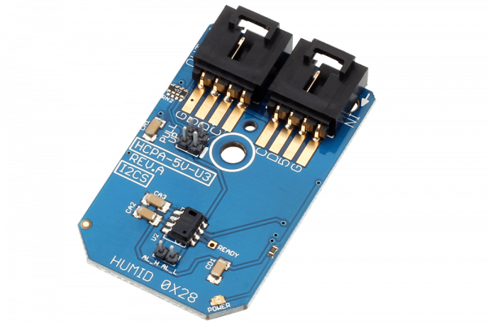

# HCPA_5V_U3

This I2C Mini Module provides an ideal solution for high accuracy humidity sensing.These capacitive polymer sensor chips are individually calibrated and tested. HumiChip® performs ±2% from 20% to 80%RH (±3% over entire humidity range) packaged in a convenient I2C Mini Module.
This Device is available from www.ncd.io 

[SKU: HCPA_5V_U3_I2CS]

(https://store.ncd.io/product/hcpa-5v-u3-humidity-and-temperature-sensor-%C2%B12rh-%C2%B10-3c-i2c-mini-module/)
This Sample code can be used with Arduino.

Hardware needed to interface HCPA_5V_U3 sensor with Arduino

1. <a href="https://store.ncd.io/product/i2c-shield-for-arduino-nano/">Arduino Nano</a>

2. <a href="https://store.ncd.io/product/i2c-shield-for-arduino-micro-with-i2c-expansion-port/">Arduino Micro</a>

3. <a href="https://store.ncd.io/product/i2c-shield-for-arduino-uno/">Arduino uno</a>

4. <a href="https://store.ncd.io/product/dual-i2c-shield-for-arduino-due-with-modular-communications-interface/">Arduino Due</a>

5. <a href="https://store.ncd.io/product/hcpa-5v-u3-humidity-and-temperature-sensor-%C2%B12rh-%C2%B10-3c-i2c-mini-module/">HCPA_5V_U3 Humidity and Temperature Sensor</a>

6. <a href="https://store.ncd.io/product/i%C2%B2c-cable/">I2C Cable</a>

HCPA_5V_U3:

This I2C Mini Module provides an ideal solution for high accuracy humidity sensing.These capacitive polymer sensor chips are individually calibrated and tested. HumiChip® performs ±2% from 20% to 80%RH (±3% over entire humidity range) packaged in a convenient I2C Mini Module.

Applications:

• Shock detection

• Impact recognition and logging

• Concussion detection

How to Use the HCPA_5V_U3 Arduino Library
The HCPA_5V_U3 is very easy to interface as following.

1.Address calling:The following command is used to call the address of HCPA_5V_U3 to start the transmission.

            hcpa.getAddr_HCPA_5V_U3(HCPA_5V_U3_DEFAULT_ADDRESS);   // 0x28 

2.Temperature measurement:The following command is used to measure the temperature in celcius.

            hcpa.getTemperature();
            
3.Humidity measurement:The following command is used to measure the humidity in %RH.

            humidity = hcpa.getHumidity();
